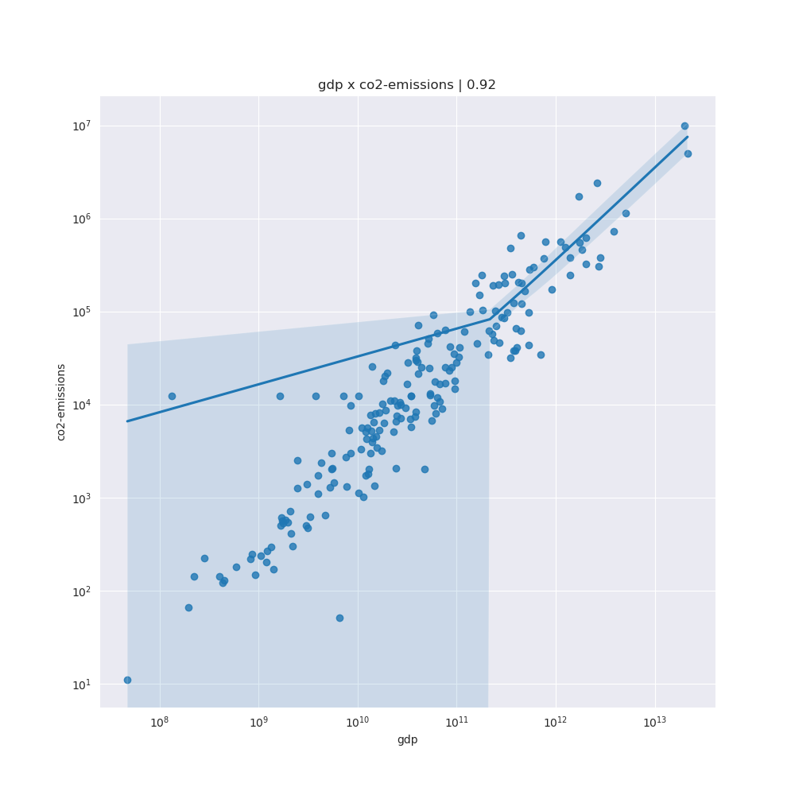
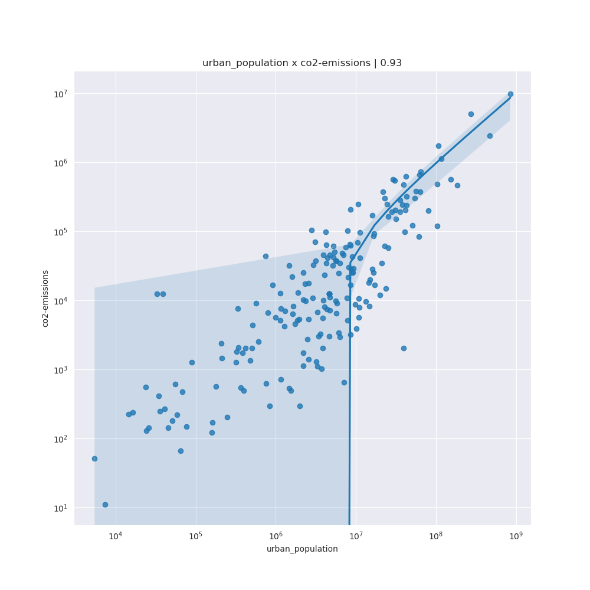
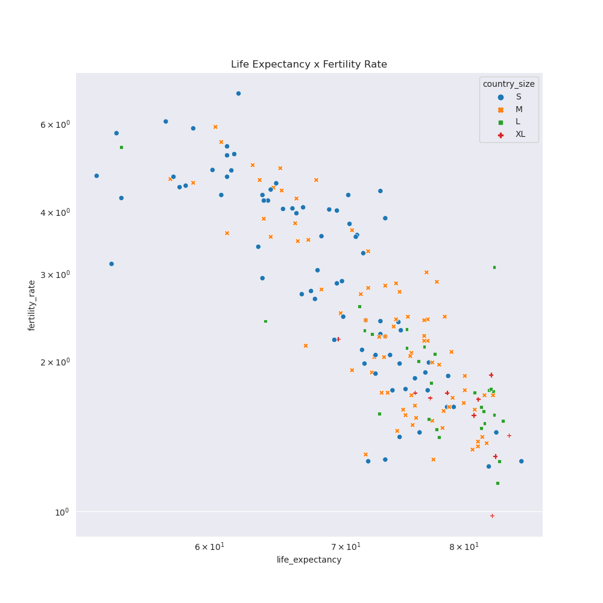

# Novas questões

## Dicionário de dados

* País: Nome do país.
* Densidade (P/Km2): Densidade populacional medida em pessoas por quilômetro quadrado.
* Abreviatura: Abreviatura ou código que representa o país.
* Terrenos Agrícolas (%): Percentagem de área de terreno utilizada para fins agrícolas.
* Área Terrestre (Km2): Área total do país em quilômetros quadrados.
* Tamanho das Forças Armadas: Tamanho das forças armadas no país.
* Taxa de natalidade: Número de nascimentos por 1.000 habitantes por ano.
* Código de Chamada: Código de chamada internacional do país.
* Capital/Cidade Principal: Nome da capital ou cidade principal.
* Emissões de CO2: Emissões de dióxido de carbono em toneladas.
* IPC: Índice de Preços ao Consumidor, medida de inflação e poder de compra.
* Variação do IPC (%): Variação percentual do Índice de Preços ao Consumidor em relação ao ano anterior.
* Currency_Code: Código da moeda utilizada no país.
* Taxa de fertilidade: Número médio de filhos nascidos de uma mulher durante a sua vida.
* Área Florestada (%): Percentual da área terrestre coberta por florestas.
* Gasoline_Price: Preço da gasolina por litro em moeda local.
* PIB: Produto Interno Bruto, valor total dos bens e serviços produzidos no país.
* Matrículas brutas no ensino primário (%): Taxa bruta de matrículas no ensino primário.
* Matrículas brutas no ensino superior (%): Taxa bruta de matrículas no ensino superior.
* Mortalidade Infantil: Número de mortes por 1.000 nascidos vivos antes de completar um ano de idade.
* Maior Cidade: Nome da maior cidade do país.
* Expectativa de vida: Número médio de anos que se espera que um recém-nascido viva.
* Razão de Mortalidade Materna: Número de mortes maternas por 100.000 nascidos vivos.
* Salário Mínimo: Nível do salário mínimo em moeda local (1) 
* Idioma Oficial: Idioma(s) oficial(ais) falado(s) no país.
* Despesas diretas com saúde (%): Percentagem do total das despesas com saúde pagas diretamente pelos indivíduos.
* Médicos por Mil: Número de médicos por mil pessoas.
* População: População total do país.
* População: Participação na Força de Trabalho (%): Percentual da população que faz parte da força de trabalho.
* Receita Fiscal (%): Receita tributária em percentagem do PIB.
* Taxa Total de Imposto: Carga tributária global como percentagem dos lucros comerciais.
* Taxa de Desemprego: Percentual da força de trabalho que está desempregada.
* População Urbana: Percentagem da população que vive em áreas urbanas.
* Latitude: Coordenada de latitude da localização do país.
* Longitude: Coordenada de longitude da localização do país.

(1) pelo que conseguimos apurar os valores estão expressos em dólares (USD). [[link](https://en.wikipedia.org/wiki/List_of_countries_by_minimum_wage)]

[fonte](https://www.kaggle.com/datasets/nelgiriyewithana/countries-of-the-world-2023)

## Possíveis linhas de análise 
(em andamento)

Este conjunto de dados fornece uma ampla gama de informações sobre diferentes países. Algumas questões interessantes que podem ser exploradas a partir desses dados incluem:

1. **Correlação entre Densidade Populacional e Outras Variáveis:** Investigar como a densidade populacional se relaciona com variáveis como área de terra, taxa de natalidade, taxa de mortalidade infantil, expectativa de vida, etc.

3. **Desenvolvimento Econômico e Educação:** Explorar a relação entre o PIB, matrícula em educação primária e terciária, e o percentual de matrícula bruta nessas áreas.

4. **Saúde e Demografia:** Comparar as taxas de mortalidade infantil, taxa de natalidade, mortalidade materna e expectativa de vida para entender a relação entre saúde e demografia.

5. **Política e Economia:** Estudar a relação entre o índice de percepção de corrupção (CPI), mudanças no CPI, taxas de impostos, receita fiscal e outros indicadores político-econômicos.

6. **Distribuição Geográfica:** Analisar a distribuição geográfica dos países com base em coordenadas de latitude e longitude para encontrar padrões regionais.

7. **Participação da Força de Trabalho e Desemprego:** Explorar como a participação da força de trabalho, a taxa de desemprego e a urbanização estão interligadas.

8. **Estabelecer categorias de países:** Realizar classificações por critérios como GDP, extensão, educação, etc

## Algumas respostas

1. Os países que mais poluem, são os que possuem maior PIB (GDP); esta característica se acentúa na faixa dos países mais ricos 
2. Outro fator que parece estar relacionado com a emissão de Co2 é o maior percentual de população urbana, que por sua vez está diretamente relacionado com a população geral.

3. Os países com maior taxa de natalidade possuem a menor expectativa de vida. 
4. Os países categorizados como pequenos e médios encontram-se espalhados por todo o range, enquanto que países grandes e muito grandes se concentram na classificação dos que possuem uma taixa de fertilidade baixa e uma alta expectativa de vida.

