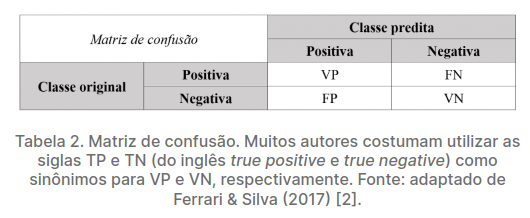
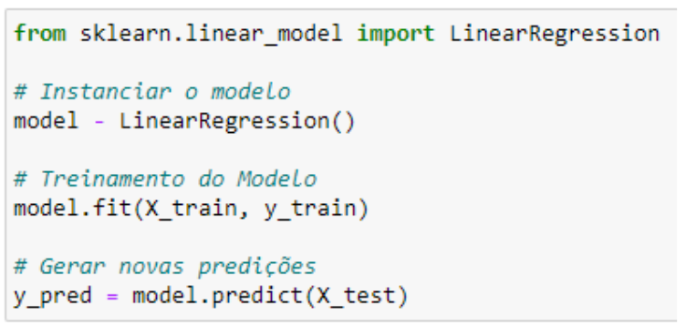
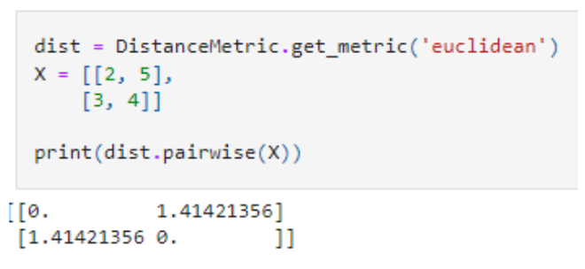

MACHINE LEARNING
================

# Supervisionado

## Divisão dos dados
Refere-se ao processo de dividir os dados em conjuntos de treinamento, validação e teste.

1. Divisão dos dados usando `from sklearn.model_selection import train_test_split`
2. __Amostragem:__ É importante garantir que os dados sejam divididos de forma aleatória e estratificada (mantem o
mesmo número de objetos para cada classe, proporcional ao conjunto original), a fim de evitar a
introdução de viés nos modelos.
3. __Balanceamento dos dados:__ Refere-se ao processo de equilibrar a distribuição de classes nas amostras de dados.

## Métricas de avaliação
Métricas que refletem a qualidade de um modelo, portanto se forem mal escolhidas, será impossível
avaliar se o modelo de fato está atendendo os requisitos necessários. Ademais, também são utilizadas
para realizar comparação de modelos.

### Métricas de avaliação de modelos de classificação [binária]
(k-NN, por exemplo)

Um modelo de classificação binária tem como objetivo decidir em qual classe uma nova observação pertence dentre duas classes possíveis. Em geral as duas classes, denominadas de positiva (P) e negativa (N), indicam a ocorrência ou não de um determinado evento. Um exemplo seria classificar se um determinado paciente possui uma determinada doença (positivo) ou não (negativo).

A avaliação de um modelo de classificação é feita a partir da comparação entre as classes preditas pelo modelo e as classes verdadeiras de cada exemplo. Todas as métricas de classificação têm como objetivo comum medir quão distante o modelo está da classificação perfeita, porém fazem isto de formas diferentes.

#### Matriz de confusão 
[Diego Mariano](https://diegomariano.com/metricas-de-avaliacao-em-machine-learning/)

Método|Fórmula
------|------
Sensibilidade|VP / (VP+FN)|
Especificidade|VN / (FP+VN)|
Acurácia|(VP+VN) / N|
Precisão|VP / (VP+FP)|
F-score|2 x (PxS) / (P+S)|

##### Acurácia
A acurácia (accuracy ou ACC) é considerada uma das métricas mais simples e importantes. Ela avalia simplesmente o percentual de acertos, ou seja, ela pode ser obtida pela razão entre a quantidade de acertos e o total de entradas.

##### Sensibilidade
Outra métrica que pode ser utilizada é a sensibilidade (também conhecida como recall ou revocação). Essa métrica avalia a capacidade do método de detectar com sucesso resultados classificados como positivos. 

##### Especificidade
Por outro lado, a especificidade avalia a capacidade do método de detectar resultados negativos.

##### Precisão
A precisão é uma métrica que avalia a quantidade de verdadeiros positivos sobre a soma de todos os valores positivos.

##### F1-score
F–measure, F-score ou score F1 é uma média harmônica calculada com base na precisão e na revocação.

### Métricas de avaliação de modelos de regressão

#### R2 score
Medida estatística que representa a proporção da variância para uma variável dependente que é explicada por uma variável independente em um modelo de regressão. Enquanto a correlação explica a força da relação entre uma variável independente e uma variável dependente, o R-quadrado explica até que ponto a variância de uma variável explica a variância da segunda variável. Portanto, se o R2 de um modelo for 0,50, aproximadamente metade da variação observada pode ser explicada pelas entradas do modelo, logo __R2 Score, normalmente, está entre 0 e 1, quanto mais próximo de 1, melhor o ajuste da regressão__.

#### Erro médio (ME)
Média da diferença do realizado e do previsto.

#### Erro médio absoluto (MAE)
Média da diferença absoluta do realizado e do previsto.

#### Erro médio quadrático (RMSE)
O desvio da amostra da diferença entre o previsto e o realizado.

#### Erro de porcentagem absoluta média (MAPE)
Diferença absoluta percentual de erro.

## Regressão
Para o funcionamento do modelo de regressão serão fornecidas informações na forma de variáveis atributos e o modelo estimará o valor da variável resposta usando dados de referência durante o treinamento. Lembrando que, para o caso da Regressão, __o tipo de resposta esperado na saída será um valor contínuo representativo de acordo com a variável resposta__. Especificamente quando se trata de Regressões Lineares, a inferência feita sobre a relação entre as variáveis é que pode ser descrita por uma equação de reta.

### Regressão linear
Na regressão linear simples, tem-se um conjunto de dados formado por **um único atributo X e a variável resposta Y**. O modelo vai procurar estabelecer a melhor equação de reta que descreva o conjunto de dados.

## Classificação: Algoritmo k-NN
__Vizinhos mais próximos__

* Classifica um novo objeto com base nos exemplos do conjunto de treinamento que são próximos a ele;
* Pode ser utilizado tanto para classificação quanto para regressão;
* Tem variações definidas (principalmente) pelo número de vizinhos considerados.

## Algoritmo Árvore de decisão
O principal objetivo do algoritmo árvore de decisão é encontrar o atributo ou variável independente que melhor realiza a divisão dos dados.Uma árvore de decisão, utiliza a técnica de dividir para conquistar:
* Um problema complexo é decomposto em subproblemas mais simples;
* Recursivamente a mesma estratégia é aplicada cada subproblema.

### Critérios para escolha dos atributos

#### Índice de Gini
**É uma medida da impureza de um nó.** Esta medida quantifica a quantidade de vezes que um elemento escolhido aleatoriamente do conjunto de dados seria rotulado de maneira incorreta se fosse rotulado aleatoriamente de acordo com a distribuição de rótulos do subconjunto. É a maneira mais popular e fácil de dividir uma árvore de decisão e funciona apenas com alvos categóricos, pois faz apenas divisões binárias. **Quanto menor a Impureza (Gini), maior a homogeneidade do nó.** A Impureza (Gini) de um nó puro (mesma classe) é igual a zero.

#### Entropia
Representa a **falta de uniformidade** ou uma medida de aleatoriedade nos dados. **Quanto mais alta a entropia, mais caótico e misturados estão os dados** e quanto menor a entropia, mais uniforme e homogênea está o conjunto de dados.

#### Ganho de informação
É uma propriedade estatística que **mede quão bem um determinado atributo separa os exemplos de treinamento de acordo com sua classificação** alvo ou rótulo. Em outras palavras, o ganho de informação **representa a informação aprendida sobre os rótulos** quando dividimos uma região do espaço em duas sub-regiões de acordo com um critério de divisão como a entropia ou impureza (gini), citadas acima.